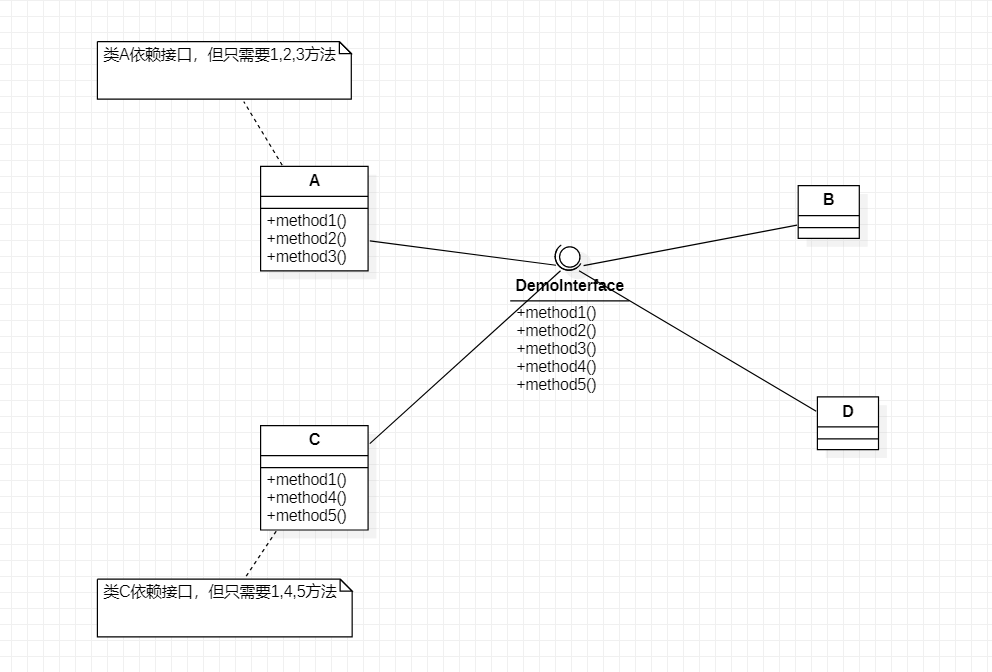

# DesignPattern

## 概论
1. 

## 基本原则
### 设计模式原则，其实是程序员在开发时需要遵守的原则。也是各种设计模式的基础
### 七大原则
* 职能单一原则 ---> Single Responsibility Principle
* 接口隔离原则 ---> Interface Segregation Principle
* 依赖倒转原则 ---> Dependence Inversion Principle
* 里氏替换原则 ---> Liskov Substitution Principle
* 开闭原则 ---> Open Closed Principle
* 迪米特法则 ---> Demeter Principle
* 合成复用原则 ---> Composite Reuse Principle

### 职能单一原则

#### 介绍

​	对类来说，一个类只应该只负责一项职能。如果类A负责了两个不同的职能（1和2），当职能1需求变更时而去改变类A可能会造成职能2的执行错误。所以需要将类A细化为两个类B和C，分别对应不同的职能。

#### 注意事项与细节

* 降低类的复杂度，一个类负责一项职能
* 提高类的可读性和可维护性，不牵扯至其他职能
* 降低功能变更是引起的风险
* 通常情况下我们应当遵守职能单一原则
  * 只有在职能足够简单的条件下才可以违反此项原则
  * 只有在类中方法足够少时可以在方法级别上保持职能单一

#### 示例
